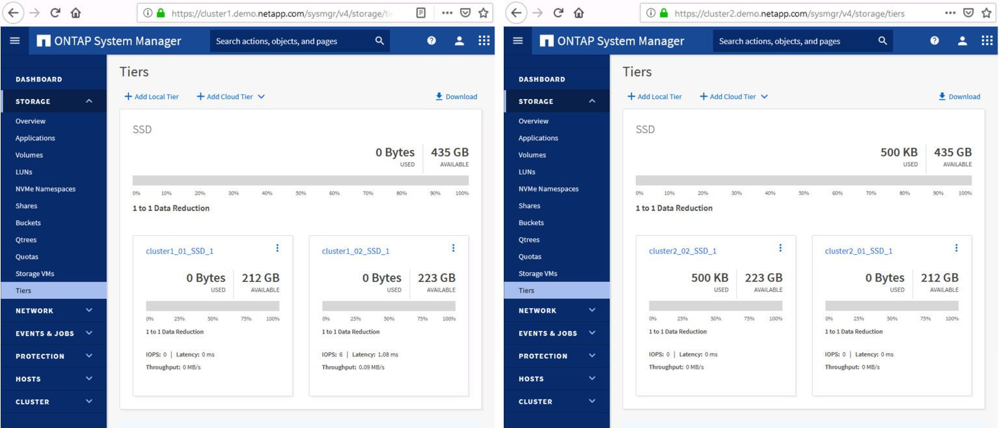
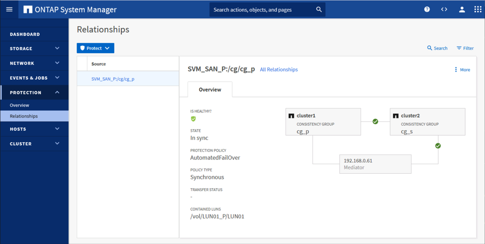

This lab allow you to test NetApp SMBC base on the following lab:
------------------------------------------------------------------
- Lab: https://labondemand.netapp.com/lab/sl10628 

Script provide with this demo allow you to build a SnapMirror SMBC LAB
----------------------------------------------------------------------
Before to start this lab you have to configure each aggregate  on cluster1 and Cluster2 using System Manager 
- using Menu **STORAGE -> Tieres -> Add Local Tier**


The following script are avaialbe to build you SMBC configuration from cluster1 and cluster2:
- The the script **0-Setup-Linux-iscsi.sh** will install all required Linux Packages and will configure kernel variable  it will and reboot the system.
- The script **1-Install-Linux-NetAppTools.sh** will automatically  Install **NetApp host utilities kit** and **the NetApp Mediator 1.2** available  the [pkg directory](https://github.com/jbnetapp/demosmbc/tree/main/pkg)   
- The script **2-Setup-ontapsmbc.sh** will automatically build the full SMBC configuration:
	- Create Intercluster LIFS on cluster1 and cluster2
	- Create Cluster peer between cluster1 and cluster2
	- Create vserver SAN with 4 iscsi DATA LIF on cluster1 and cluster2
	- Create vserver peer between vserver SAN of cluster1 and cluster2
	- Create a certificate for the Mediator on cluster1 and cluster2
	- Add a mediator on Cluster1 and Cluster2
	- Create a new SAN Lun on a new volume on Cluster1
	- Create SnapMirror synchronous consistency group replication from this volume to the cluster2 with *AutomatedFailOver* policy
	- Mapp the LUN to the iqn/igroup from cluster1 and cluster2
	
- The script **3-Linux-LunDiscover.sh**
	- The script will discover the LUN and create a LVM configuration on top of the LUN with and ext4 filesystem
	
you can reverse the configuration bye running the script the following scripts:
- The first script **Reverse-3-Linux-LunDiscover.sh** will automatically unmap the LUN and will remove all Linux devices and iscsi targets discoverd by the script *3-Linux-LunDiscover.sh*
- The sceconds script **Reverse-2-Setup-ontapsmbc.sh** will delete all ONTAP LUN and SVM, mediator, certificate etc.. this script **MUST** be run after the script *Reverse-3-Linux-LunDiscover.sh*

- All script used the same configuration File **Setup.conf**

# Example
Used putty to logon with ssh on the linux centos01
````
IP: 192.168.0.61
Login root
Password: Netapp1! 
````
Use git clone to get all script and required packages
````
[root@centos1 ~]# mkdir git
[root@centos1 ~]# cd git
[root@centos1 git]# cgit clone https://github.com/jbnetapp/demosmbc
[root@centos1 git]# cd demosmbc/
````

Run the first script to check in install yum package and confirm the grub kernel update and confirm the linux reboot:
````
[root@centos1 demosmbc]# ./0-Setup-Linux-iscsi.sh
...
...
Run: [grubby --args rdloaddriver=scsi_dh_alua --update-kernel /boot/vmlinuz-3.10.0-1160.6.1.el7.x86_64] [y/n]? : y
Reboot Linux now [y/n]? : y

[root@centos1 demosmbc]# ./0-Setup-Linux-iscsi.sh
...
...
Terminate
````
Run the second script to install NetApp Linux Package *Host utilities kit* and *NetApp Mediator 1.2* 
````
[root@centos1 demosmbc]# ./2-Setup-ontapsmbc.sh
...
...
...
Terminate
````

Check the Mediator status on both clusters
````
[root@centos1 demosmbc]# ./runallcluster snapmirror mediator show
/usr/bin/sshpass
/usr/sbin/multipath
/usr/bin/rescan-scsi-bus.sh
Init SSH session host
=========================================================================================
cluster1 > snapmirror mediator show
Access restricted to authorized users

Last login time: 12/21/2020 20:55:47
Mediator Address Peer Cluster     Connection Status Quorum Status
---------------- ---------------- ----------------- -------------
192.168.0.61     cluster2         connected         true

=========================================================================================
cluster2 > snapmirror mediator show
Access restricted to authorized users

Last login time: 12/21/2020 20:55:48
Mediator Address Peer Cluster     Connection Status Quorum Status
---------------- ---------------- ----------------- -------------
192.168.0.61     cluster1         connected         true
````

Check SnapMirror and verify if the same Lun has been created on both clusters with same serial number
````
[root@centos1 demosmbc]# ssh -l admin cluster2 snapmirror show
Access restricted to authorized users
Password:
Last login time: 12/21/2020 20:44:24
                                                                       Progress
Source            Destination Mirror  Relationship   Total             Last
Path        Type  Path        State   Status         Progress  Healthy Updated
----------- ---- ------------ ------- -------------- --------- ------- --------
SVM_SAN_P:/cg/cg_p XDP SVM_SAN_S:/cg/cg_s Snapmirrored InSync - true   -

[root@centos1 demosmbc]# ./runallcluster lun show -fields serial
/usr/bin/sshpass
/usr/sbin/multipath
/usr/bin/rescan-scsi-bus.sh
Init SSH session host
=========================================================================================
cluster1 > lun show -fields serial
Access restricted to authorized users

Last login time: 12/21/2020 20:44:23
vserver   path               serial
--------- ------------------ ------------
SVM_SAN_P /vol/LUN01_P/LUN01 wOj7N$QPt5OO

=========================================================================================
cluster2 > lun show -fields serial
Access restricted to authorized users

Last login time: 12/21/2020 20:46:56
vserver   path               serial
--------- ------------------ ------------
SVM_SAN_S /vol/LUN01_S/LUN01 wOj7N$QPt5OO
````

Run the script to discover the LUN on Linux and create a ext4 file sytem on LVM using this LUN
````
[root@centos1 demosmbc]# ./3-Linux-LunDiscover.sh
....
Terminate

````

Verfiy if you have see the file system on LVM device
````
[root@centos1 demosmbc]# df -h /data
Filesystem               Size  Used Avail Use% Mounted on
/dev/mapper/vgdata-lv01  8.8G   37M  8.3G   1% /data

[root@centos1 demosmbc]# vgdisplay vgdata -v |grep "PV Name"
  PV Name               /dev/mapper/3600a0980774f6a374e24515074354f4f
````

Check verify you have 8 available path for the LUN (4 on each cluster)
````
[root@centos1 demosmbc]# multipath -ll /dev/mapper/3600a0980774f6a374e24515074354f4f
3600a0980774f6a374e24515074354f4f dm-2 NETAPP  ,LUN C-Mode
size=9.0G features='4 queue_if_no_path pg_init_retries 50 retain_attached_hw_handle' hwhandler='1 alua' wp=rw
|-+- policy='service-time 0' prio=50 status=active
| |- 66:0:0:0 sdc 8:32  active ready running
| `- 68:0:0:0 sde 8:64  active ready running
`-+- policy='service-time 0' prio=10 status=enabled
  |- 65:0:0:0 sdb 8:16  active ready running
  |- 67:0:0:0 sdd 8:48  active ready running
  |- 70:0:0:0 sdg 8:96  active ready running
  |- 69:0:0:0 sdf 8:80  active ready running
  |- 72:0:0:0 sdh 8:112 active ready running
  `- 71:0:0:0 sdi 8:128 active ready running

[root@centos1 demosmbc]# sanlun lun show
controller(7mode/E-Series)/                                  device          host                  lun
vserver(cDOT/FlashRay)        lun-pathname                   filename        adapter    protocol   size    product
---------------------------------------------------------------------------------------------------------------
SVM_SAN_S                     /vol/LUN01_S/LUN01             /dev/sdi        host71     iSCSI      9g      cDOT
SVM_SAN_S                     /vol/LUN01_S/LUN01             /dev/sdh        host72     iSCSI      9g      cDOT
SVM_SAN_S                     /vol/LUN01_S/LUN01             /dev/sdg        host70     iSCSI      9g      cDOT
SVM_SAN_S                     /vol/LUN01_S/LUN01             /dev/sdf        host69     iSCSI      9g      cDOT
SVM_SAN_P                     /vol/LUN01_P/LUN01             /dev/sde        host68     iSCSI      9g      cDOT
SVM_SAN_P                     /vol/LUN01_P/LUN01             /dev/sdc        host66     iSCSI      9g      cDOT
SVM_SAN_P                     /vol/LUN01_P/LUN01             /dev/sdd        host67     iSCSI      9g      cDOT
SVM_SAN_P                     /vol/LUN01_P/LUN01             /dev/sdb        host65     iSCSI      9g      cDOT

````

Now you are ready to play with SMBC in real life :smile:


NetApp SMBC Documentation is available here:
--------------------------------------------
- Doc: https://docs.netapp.com/us-en/ontap/smbc

